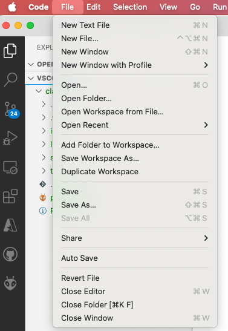
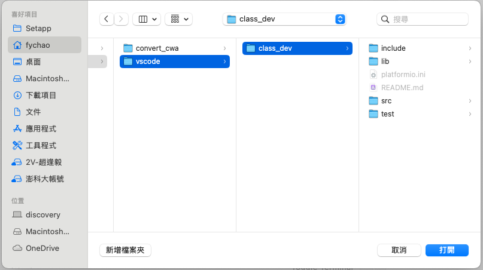

# 開發流程

## 0318

### 環境調整
- 我已把開發環境目錄改為 `ide_vscode/vscode/class_dev`
- 請依下列流程設定你的開發環境





### 小組討論 - 期末專題討論
因老師 09:30 要去開會，故請進行小組討論，預計 4/8 日(期中考周)進行小組分享 (4/25 抽順序)。

[](https://www.youtube.com/watch?v=sjIpt7wNMN8)

影片中，請選三個小組覺得有趣的 topics，並回答：

1. **該 Project 的主軸是什麼？**
   - 這個專案的主要目標是展示如何使用 ESP32 開發一個智能家居系統 🏠。

2. **用了什麼電子元件達成該專案？**
   - 使用了 ESP32 開發板、DHT11 溫濕度感測器、繼電器模組和 LED 燈 💡。

3. **為什麼小組覺得有趣？**
   - 小組認為這個專案有趣是因為它展示了如何將多個感測器和設備整合到一個系統中，並且可以通過手機應用程式進行控制 📱。

4. **如果是我們小組來做，我們小組打算做成…**
   - 小組的創意發想

-> 請寫成投影片，今天的點名上傳(同組可上傳同一份) 📋

### [README for 0318](lib/class0318/README.md)
1. **識別與理解** ESP32 透過 WiFi 連接到網路與 MQTT 伺服器的基本概念。  
2. **解釋** MQTT 的運作方式，並說明如何透過回呼函式處理 MQTT 訊息。  
3. **實作** ESP32 連接 WiFi，訂閱 MQTT 主題，並讓 LED 燈依據 MQTT 訊息閃爍。  
4. **分析** 程式碼的模組結構，包括 WiFi 連線、MQTT 連線與 LED 控制，理解其相互關聯性。  
5. **測試與優化** MQTT 連線機制，確保系統能夠穩定運行，並能夠在斷線時自動重新連接。  
6. **設計與延伸應用**，根據學習內容，開發新的 MQTT 應用，例如使用不同訂閱主題來控制多個設備。

## 0311
我們將學習如何在 ESP32 上開發藍牙功能，包括藍牙經典（Bluetooth Classic）和藍牙低功耗（BLE）。​課程內容涵蓋以下幾個部分：​

1. 初始化和設置：
   - 設置 LED 引腳：​我們將學習如何設定 ESP32 的 GPIO 引腳來控制 LED 的開關。​
   - 設定藍牙設備名稱和 UUID：​瞭解如何為您的藍牙設備指定名稱和唯一識別碼（UUID），以便其他設備能夠識別和連接。​
   - 初始化藍牙：​學習如何啟動 ESP32 的藍牙模組，為後續的藍牙操作做好準備。​
2. 藍牙經典功能：
   - startBluetoothService：​我們將學習如何初始化藍牙並啟動服務，使 ESP32 能夠被其他藍牙設備發現和連接。​
   - scanBluetoothDevices：​瞭解如何使用異步和同步方式掃描周圍的藍牙設備，並獲取它們的資訊。​
   - repeatMyTyping：​學習如何接收並回應藍牙串口傳輸的資料，實現簡單的數據通信。​
3. BLE 功能：
   - startBLEService：​我們將學習如何創建 BLE 伺服器、服務和特徵，並啟動廣播，使其他 BLE 設備能夠發現並連接。​
   - MyServerCallbacks 和 MyCharacteristicCallbacks：​瞭解如何處理 BLE 連接和特徵讀寫的回調函數，以管理連接狀態和數據傳輸。​

通過這些學習，您將掌握如何設置和控制 LED，初始化和使用藍牙經典和 BLE 功能，並處理藍牙設備的掃描、連接和數據傳輸。​此外，您還將學習如何實現 BLE 伺服器和特徵的回調函數，以有效管理連接和數據讀寫事件。

## 0304

在 `run_class0303_setup()` [class0303.cpp#L118](https://github.com/DevSecOpsLab-CSIE-NPU/IoT-RD/blob/08295148b4be0d639726e4be478ec4821da6604b/0304/vscode/class_dev/lib/class0303/class0303.cpp#L118)中
1. 在 class0303.h 中建立 hello world 函數 🌍
2. 嘗試連接你的 WiFi 📶
3. 當連接到 WiFi 時，嘗試 ping Google 🌐
4. 連接成功！點亮藍色 LED 💡
5. 嘗試獲取天氣資訊 ☁️
6. 嘗試解析天氣資訊的 JSON 資料 📊

問與答：
- 為什麼我們不直接使用 CWA 的 JSON 資料？ 🤔

```
#define ARDUINOJSON_SLOT_ID_SIZE 4
#define ARDUINOJSON_DEFAULT_NESTING_LIMIT 20
```
