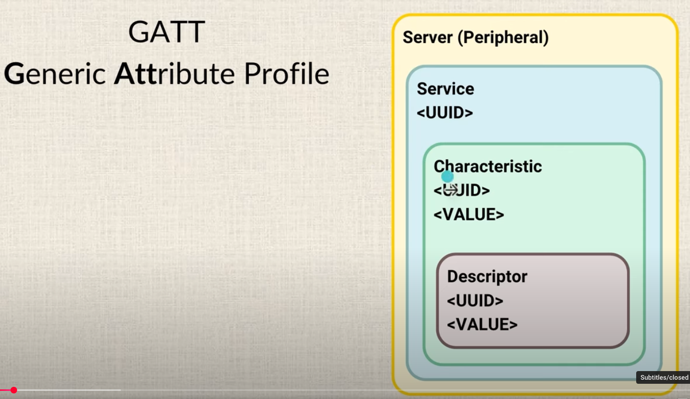
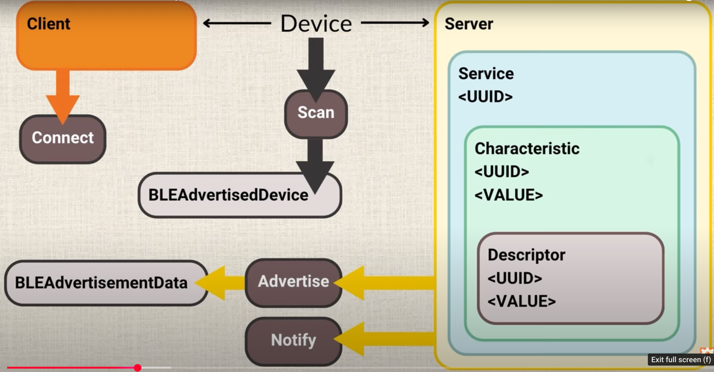
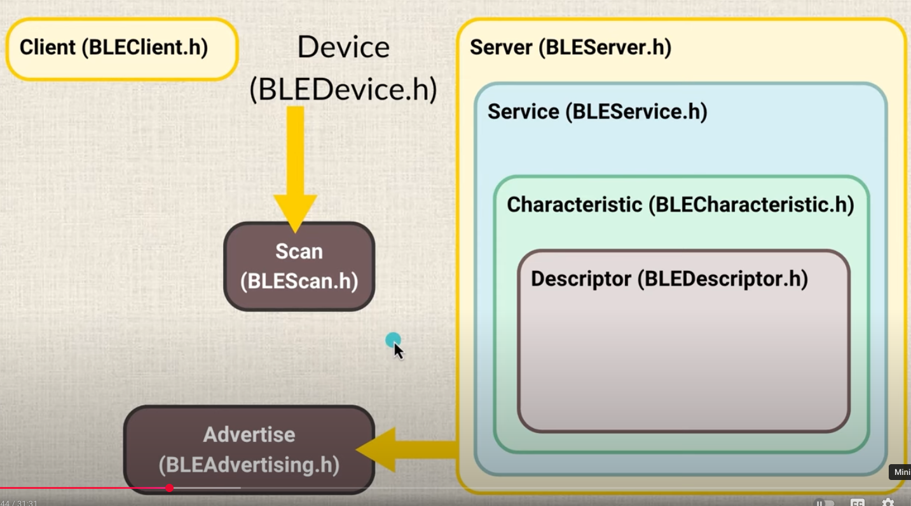

# Bluetooth Low Energy (BLE)

the GATT (Generic Attribute Profile)

https://youtu.be/XXs1b-iohg4

概念：
- Server 包 Service <UUID>, 
- Service 包 Characteristic <UUID>, <VALUE>
- Characteristic 包 Descriptor <UUID>, <VALUE>

函式庫
