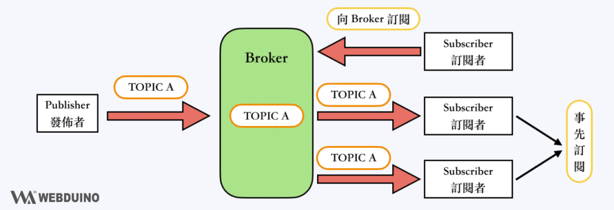
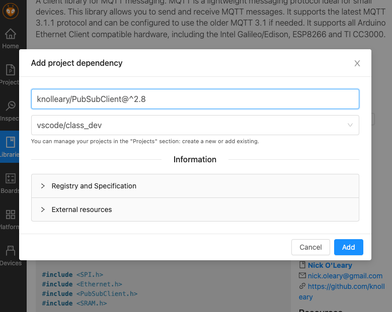
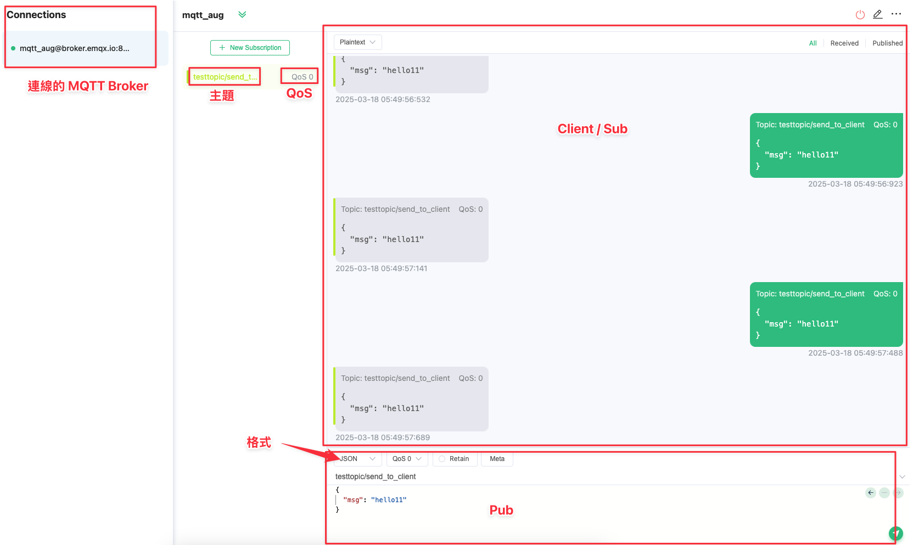

# Class for 0318

## **學習目標**
1. **識別與理解** ESP32 透過 WiFi 連接到網路與 MQTT 伺服器的基本概念。  
2. **解釋** MQTT 的運作方式，並說明如何透過回呼函式處理 MQTT 訊息。  
3. **實作** ESP32 連接 WiFi，訂閱 MQTT 主題，並讓 LED 燈依據 MQTT 訊息閃爍。  
4. **分析** 程式碼的模組結構，包括 WiFi 連線、MQTT 連線與 LED 控制，理解其相互關聯性。  
5. **測試與優化** MQTT 連線機制，確保系統能夠穩定運行，並能夠在斷線時自動重新連接。  
6. **設計與延伸應用**，根據學習內容，開發新的 MQTT 應用，例如使用不同訂閱主題來控制多個設備。

## MQTT 協議

MQTT（訊息佇列遙測傳輸）是一種輕量級的訊息傳輸協議，專為小型感測器和移動設備設計，優化於高延遲或不穩定的網絡。由於其簡單性和高效性，它廣泛應用於物聯網（IoT）應用中。



### 特點

- **輕量且高效**：最小的開銷，非常適合受限環境。
- **發布/訂閱模型**：解耦訊息生產者和消費者，增強可擴展性。
- **服務質量（QoS）**：提供三種訊息傳遞保證等級（0、1、2）。
- **保留訊息**：為新訂閱者存儲主題的最後一條訊息。
- **遺囑訊息（LWT）**：通知其他客戶端有關未正常斷開連接的客戶端。

## 設計重點

### 1. 使用函式庫 `PubSubClient` 加入專案

如下圖



### 2. 操作 MQTT 的幾個重要點（以 EMQX 為例）

1. **Endpoint**：MQTT 伺服器的地址和端口號。例如：`mqtt://broker.emqx.io:1883`。
2. **Topic**：訊息的主題，用於分類和過濾訊息。例如：`testtopic/send_to_client`。
3. **Authentication**：身份驗證參數，包括用戶名和密碼。例如：
    ```yaml
    username: your_username
    password: your_password
    ```
4. **Client ID**：每個 MQTT 客戶端的唯一標識符。例如：`clientId-12345`。
5. **QoS（服務質量）**：選擇適當的 QoS 等級（0、1、2）來保證訊息傳遞的可靠性。
6. **Keep Alive**：設置心跳間隔時間，以確保連接的持續性。例如：`keepAlive: 60`（秒）。

#### ⚠️ EMQX 的使用重點 ⚠️

公開的 MQTT Broker 就是不用到 Production (正式版)環境，如果被 **爆破** 了，就請自行處理!!

連線網址：[https://mqttx.app/web-client](https://mqttx.app/web-client#) 👈
### 開發流程 as Sub

```
        +----------------+
        |    setup()     |
        +----------------+
                |
                v
        +----------------+
        |  setupMQTT()   |
        +----------------+
                |
                v
        +--------------------+
        | client.setServer() |
        | client.setCallback() |
        | client.connect()   |
        +--------------------+
                |
       +--------+---------+
       |                  |
       v                  v
  [成功]                [失敗]
  MQTT 連線成功       顯示錯誤訊息
  訂閱 MQTT_TOPIC
       
  (主程式 loop 運行)
                |
                v
        +----------------+
        |  checkMQTT()   |
        +----------------+
                |
                v
        +----------------+
        | client.connected()? |
        +----------------+
                |
       +--------+---------+
       |                  |
       v                  v
    [已連線]          [未連線]
    執行 client.loop()  呼叫 reconnect()
                          |
                          v
                 +----------------+
                 |   reconnect()  |
                 +----------------+
                          |
                          v
                 +----------------------+
                 | client.connect()      |
                 +----------------------+
                          |
                 +--------+--------+
                 |                 |
                 v                 v
              [成功]              [失敗]
            訂閱 MQTT_TOPIC       等待 5 秒後重試

 (當有訊息到達)
                |
                v
        +----------------+
        |   callback()   |
        +----------------+
                |
                v
       解析 topic 和 payload
       並輸出到 Serial

```

## EMQX 網頁工具的操作界面

